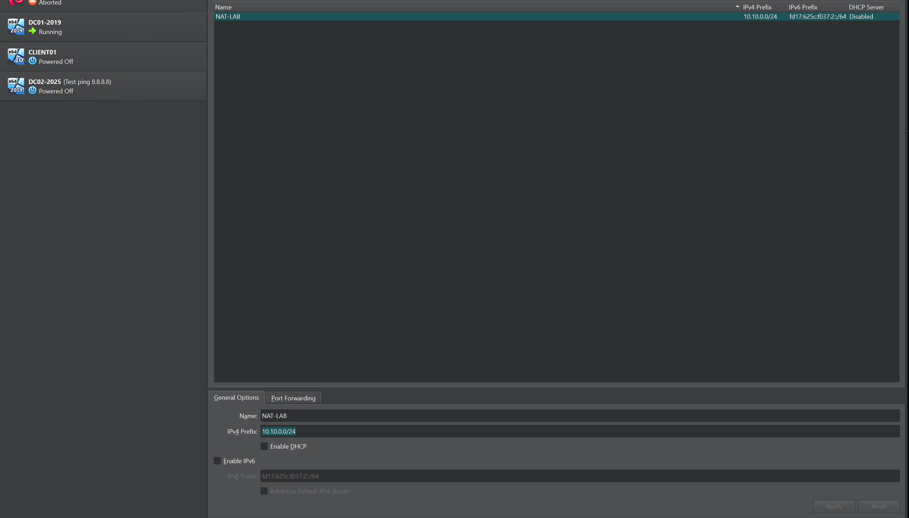
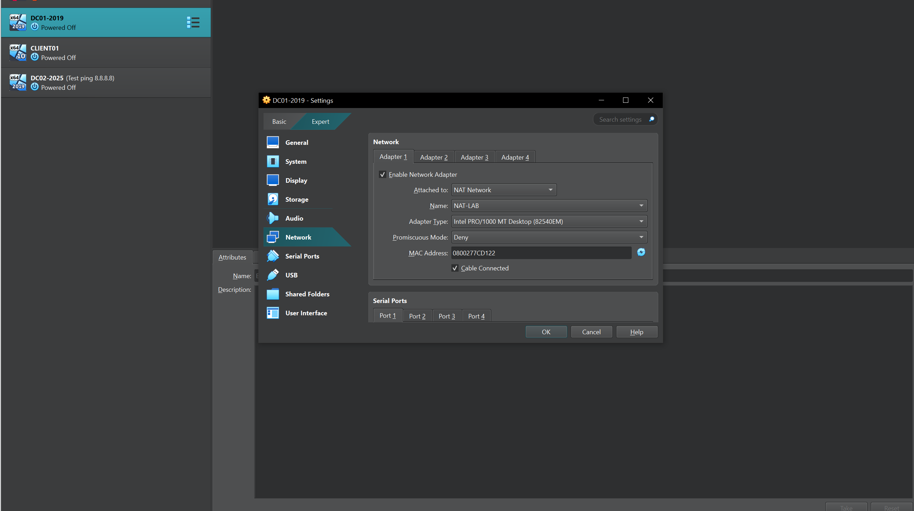
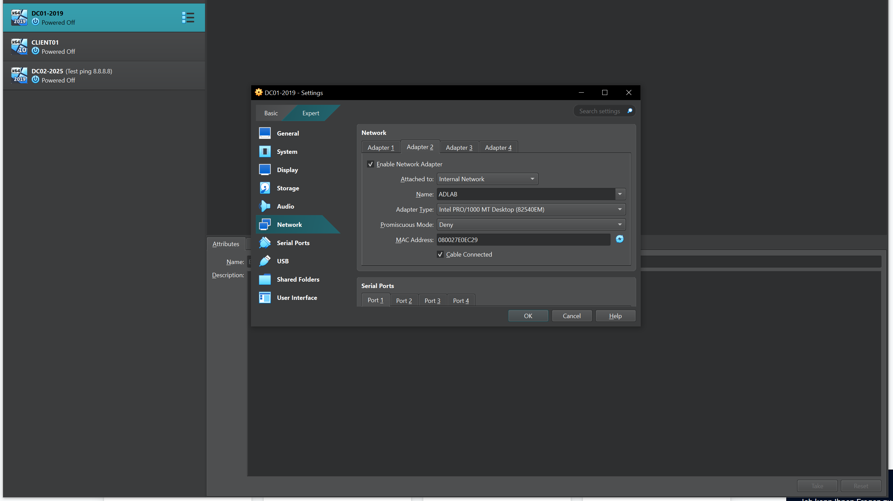

First I navigated through FIle->Tools->Networkmanager and went to the following Tab "NAT Network" to configure the external Network. Thus I created "NAT-LAB" and gave it a IPv4 Prefix and disabled DHCP, to set it up manually later with the Server-Manager

Then after setting up the Server-Whizard, i've configured the network adapters. So in this case the first Tab as "external Network".

and the second one as "internal Network"

