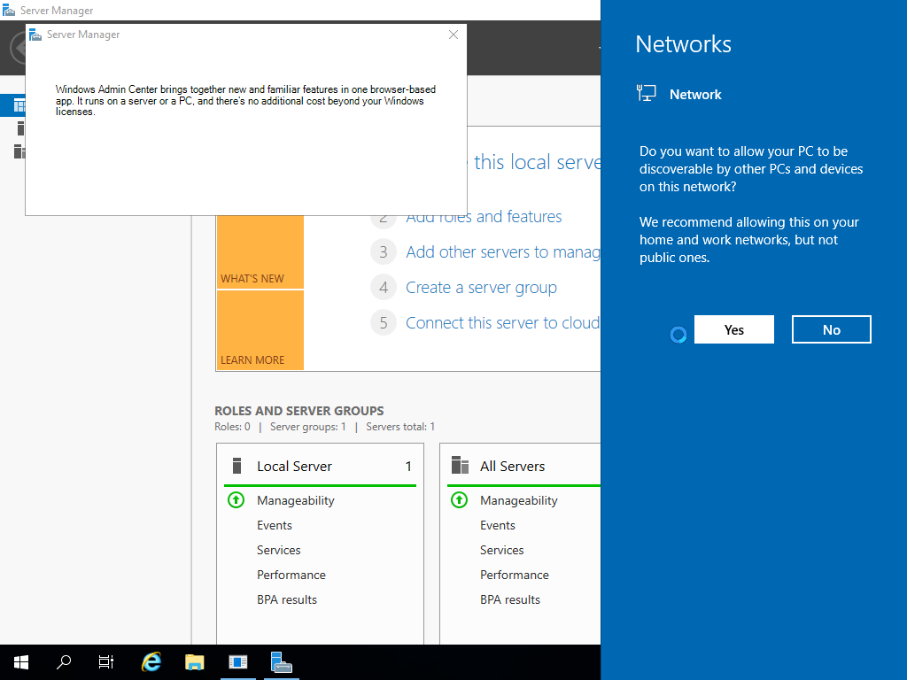
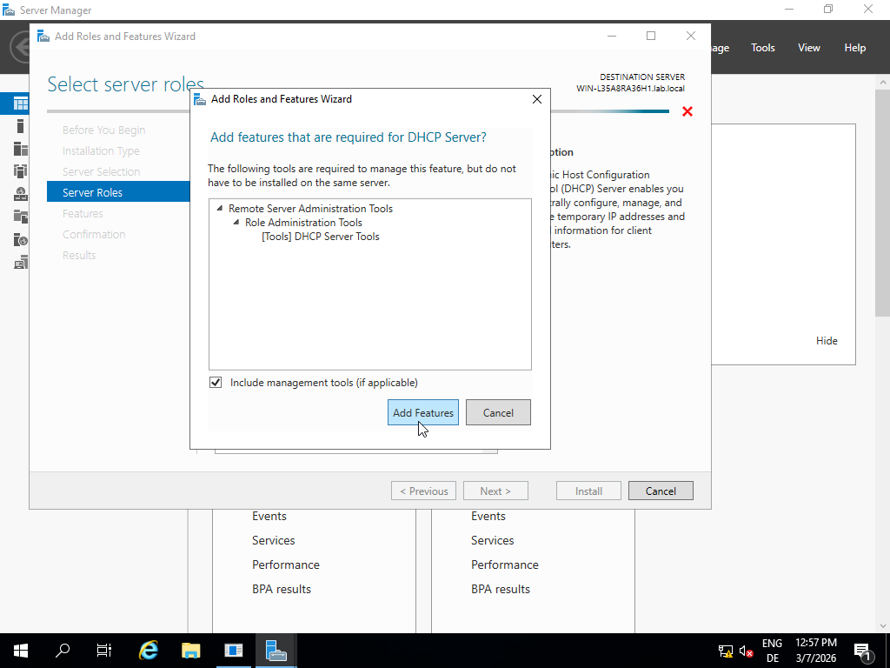
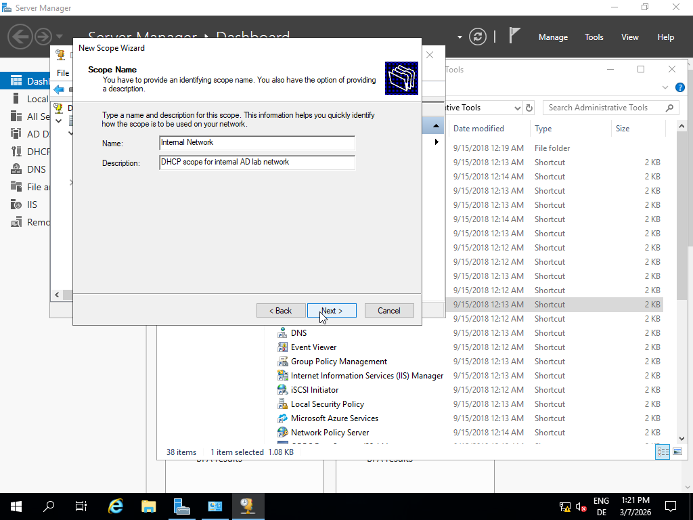
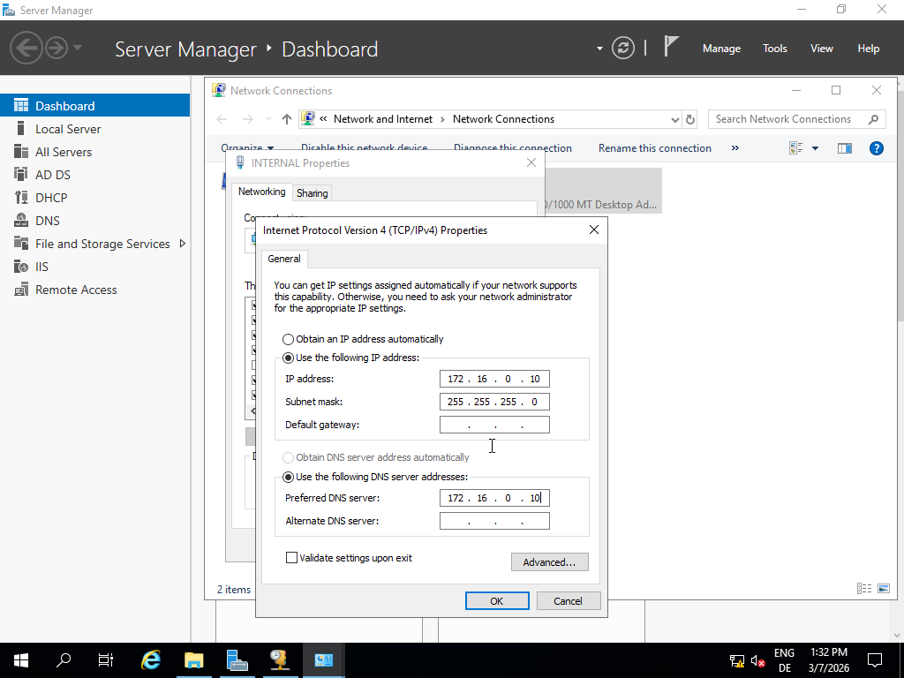
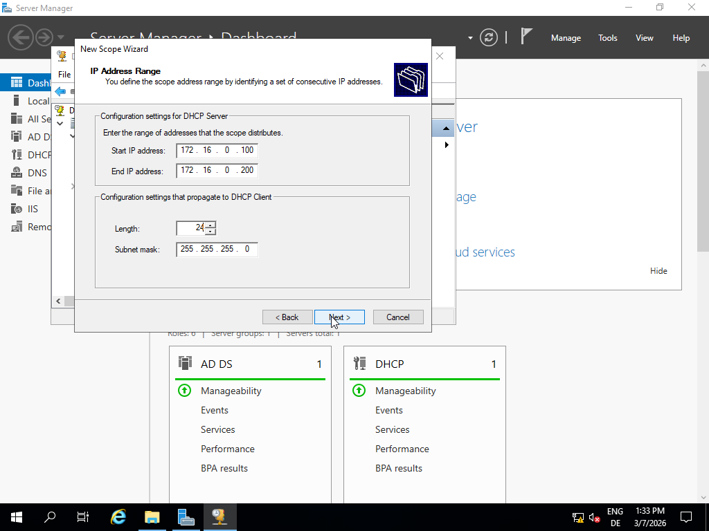
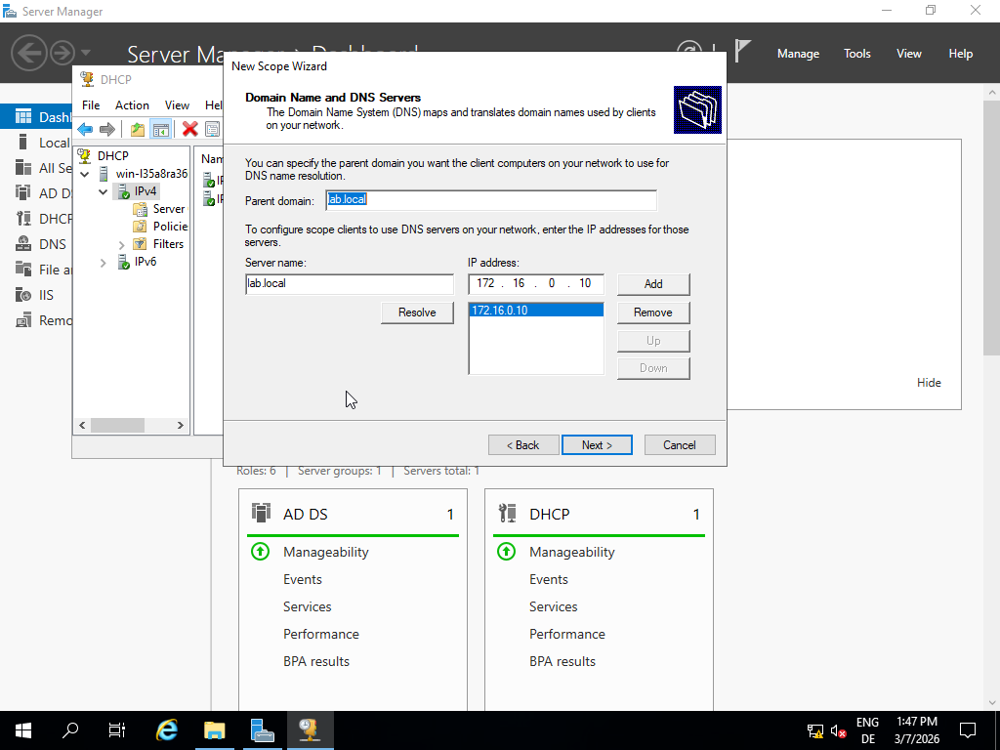

As described earlier on i've now checked the DHCP-box.

And here i installed DHCP Server, so that the Client gets an IP automatically at the next step.

Then, i just authorized DHCP up here.

Following to the authorization, i navigated to "Windows Administrative Tools" -> double-click on "DHCP" -> right-click on "IPv4" 

By opening the Wizard, i first gave the scope following name, same as description.

Before destinating the DHCP-Scope, i looked up my DNS, same as the Subnet-mask, to type in these informations corecctly.

Afterwards, i set the range of Scope, which IP-addresses i inlcude for now, and typed in the number of my Servers Subnet mask.

To pair Scope-Clients with my DNS i also typed in my Server-name, same as my IP-address. 

And now, the DHCP-Scope-Configuration is completed

