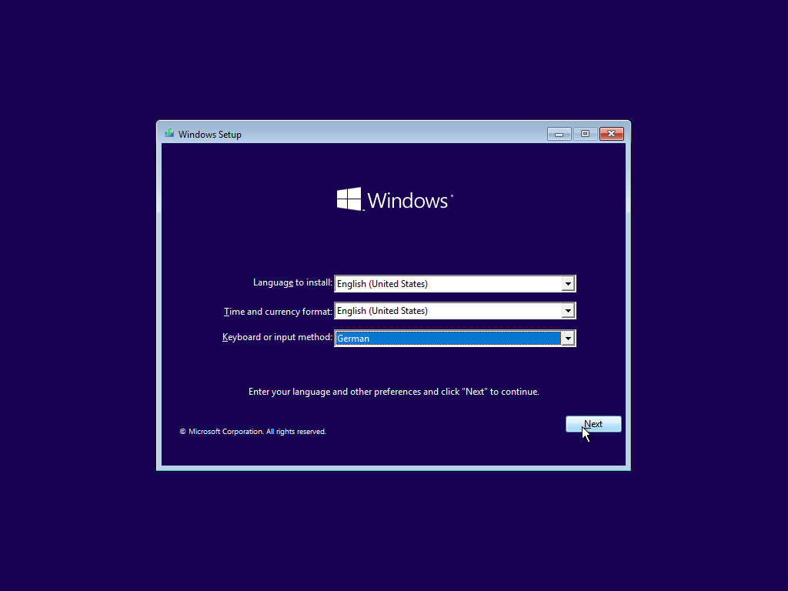
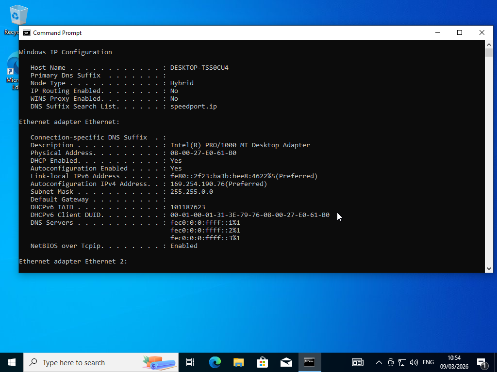
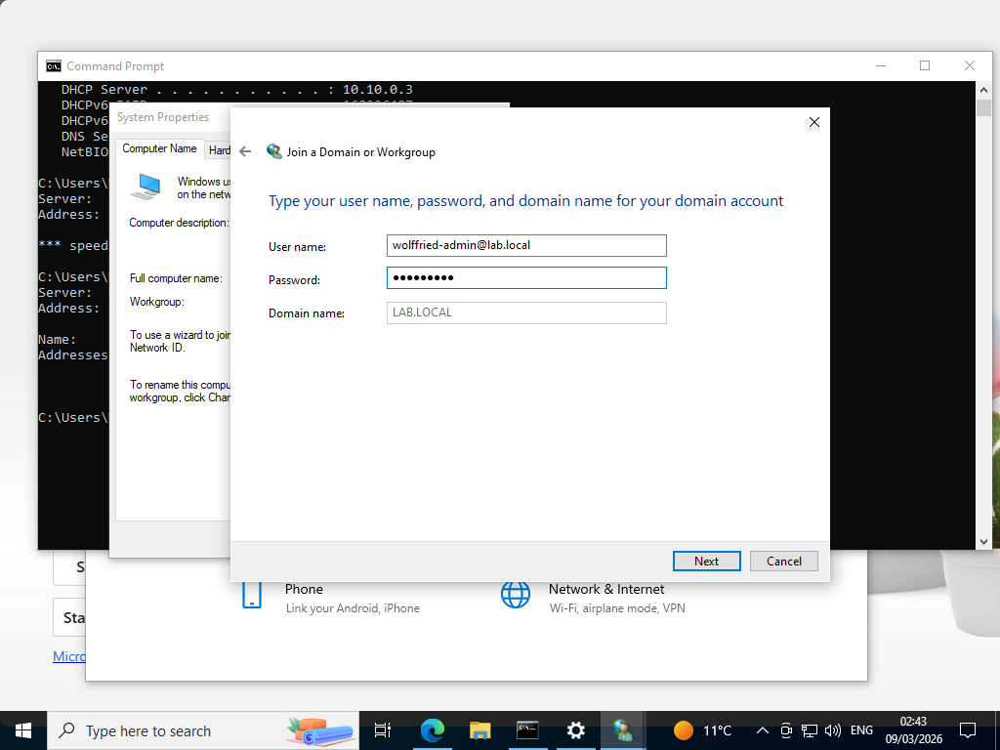
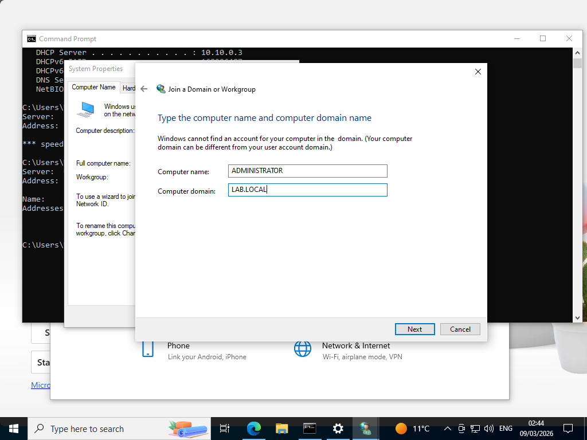
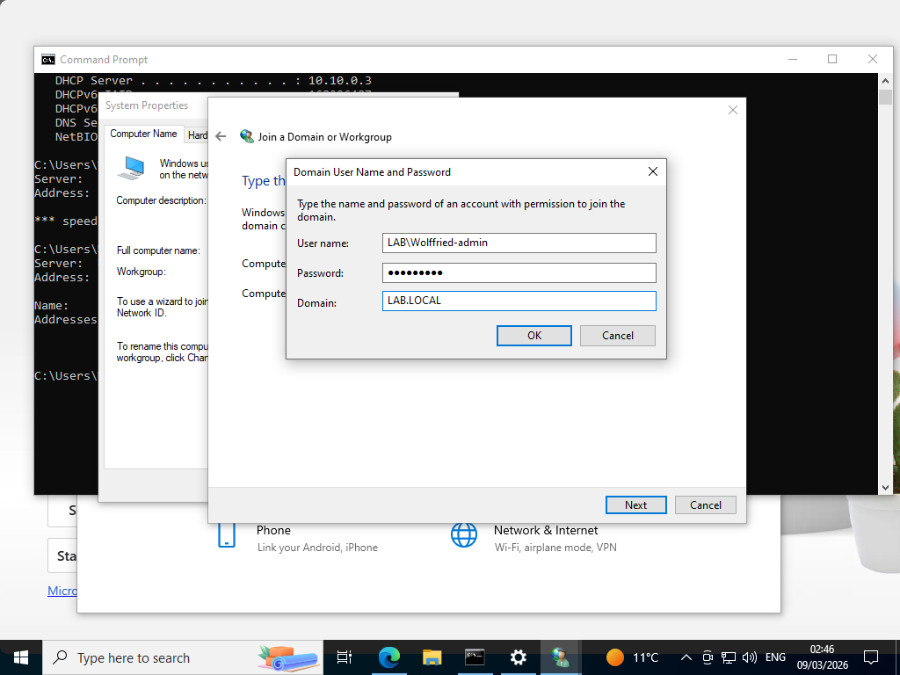
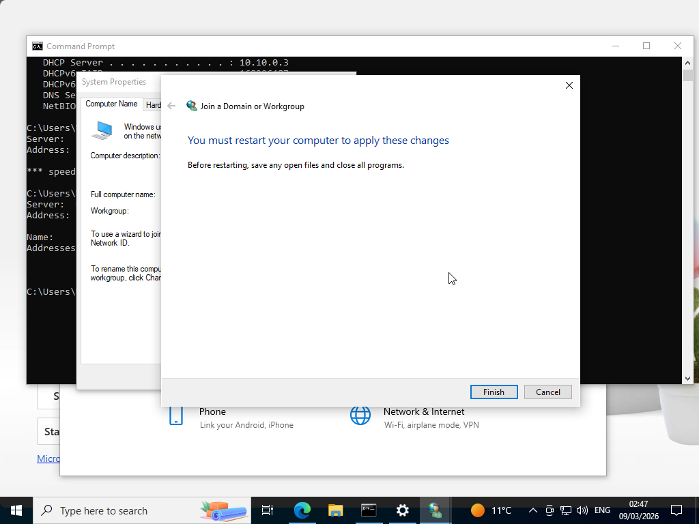

I started by Installing the Client.

When i prepared the join, i've first checked if DHCP is received on the Client. On the Screenshot you can see that DHCP is enabled.
(But you can also see the first Error, which represents that the DNS isnt recognized properly.)

After fixing the DNS-Problem u can read in 08-troubleshooting, i then started loging in with my Domain-Admin i created earlier on, and also typed in the password as well as the Domain name.

Then, i typed in the Domain Controller and the Computer Domain again.

and finally logged in with the User's credentials (Domain Admin), but instad of "LAB/Wolffried-admin" i typed in wolffried-admin@lab.local.

So now it forces a restart.

While forcing a restart, the vm stucked while loading. So i decided to force the restart via "ctrl + R". The Process of joining the domain didnt vanished, so i normally logged in.

and thats it for now.
